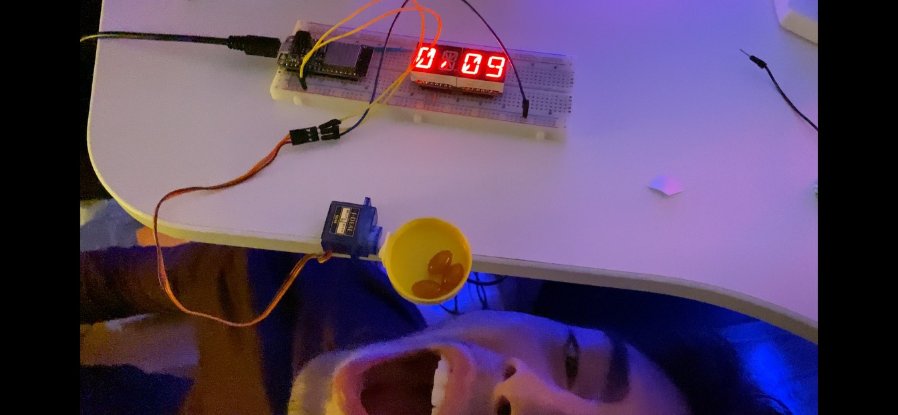
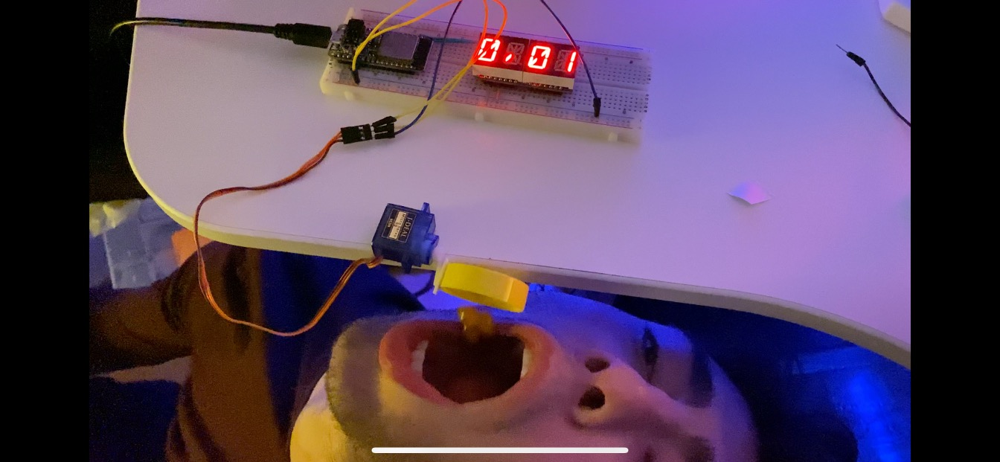

# Quest Name
Authors: Anthony Biondo, Alex Prior, Allen Zou

Date: 2020-09-22
-----

## Summary
Using the ESP32 board’s built in timer, we created a countdown clock that descended from 120 seconds and rotated a servo 3 times upon hitting 0 seconds. This then loops back and continuously counts down the servo action from 2 minutes.

## Self-Assessment

### Objective Criteria

| Objective Criterion | Rating | Max Value  | 
|---------------------------------------------|:-----------:|:---------:|
| Objective One | 1 |  1     | 
| Objective Two | 1 |  1     | 
| Objective Three | 1 |  1     | 
| Objective Four | 1 |  1     | 
| Objective Five | 1 |  1     | 
| Objective Six | NA |  1     | 
| Objective Seven | 1 |  1     | 

### Qualitative Criteria

| Qualitative Criterion | Rating | Max Value  | 
|---------------------------------------------|:-----------:|:---------:|
| Quality of solution | 4 |  5     | 
| Quality of report.md including use of graphics | 3 |  3     | 
| Quality of code reporting | 3 |  3     | 
| Quality of video presentation | 3 |  3     | 

## Solution Design

# Timer:
In order to utilize the ESP32’s timer, we first looked back to Skill 11 to understand how to initialize, start, pause, and modify its functionality. Then, we thought about how we wanted to use the timer in the context of the fish feeder. Since we wanted to feed our fat fish every 2 minutes, we initialized an integer counter variable at 120 seconds, decrementing it with every timer event, which we timed to occur every 1 second. Once the counter reaches 0, we use the timer_pause() function to stop the countdown and execute the servo functionality. Once the servo is done tipping food, we use the timer_start() function to begin counting again, reinitializing the counter integer to 120.

# Display:
The LED display uses the ESP32’s i2c ports to provide a visual representation of the countdown time for users. We accomplished this by taking advantage of the modulo operator and integer division to split the timer into its individual time increments. These are then displayed on the LED screen every second as the timer changes.

# Servo:
In order to coordinate the servo action with the end of the timer we used a large portion of the code from the servo example for skill 9. We added a conditional statement that once the countdown reached 0 the timer is paused and the servo is activated with specific angles. In addition at this step we reset the counter to begin at 2 minutes so the timer would be re initiated. 

## Sketches and Photos

  

With 31 seconds left on the timer, the servo is stationary and will not begin it's rotation routine until the timer hits 0 seconds 

 

A before and after feeding our fish when the timer is completed (*These photos were taken before our live demo so the time has a timer_pause() when the servo is running so it stops at 00:01. However, we have changed that and the video presentation has the non paused timer) 

# Investigative question: What approach can you use to make setting the time interval dynamic (not hard coded)? Elaborate.
Instead of declaring our timer interval statically, we can get user input using the gets() function and prompt the user for their preferred time interval when the program runs. This will allow the users to customize their fish feeder and give them the choice to starve their fish with a 2 day feeding cycle or fatten them up with food every 10 seconds.

## Supporting Artifacts
- [Click here for Quest 1 Demo](https://drive.google.com/file/d/1JzEWCGhAjof0glUlmwND12N0k9ruO4DT/view?usp=sharing)

## Modules, Tools, Source Used Including Attribution
We worked with John Kircher who helped us with our thought process for this quest

## References

-----

