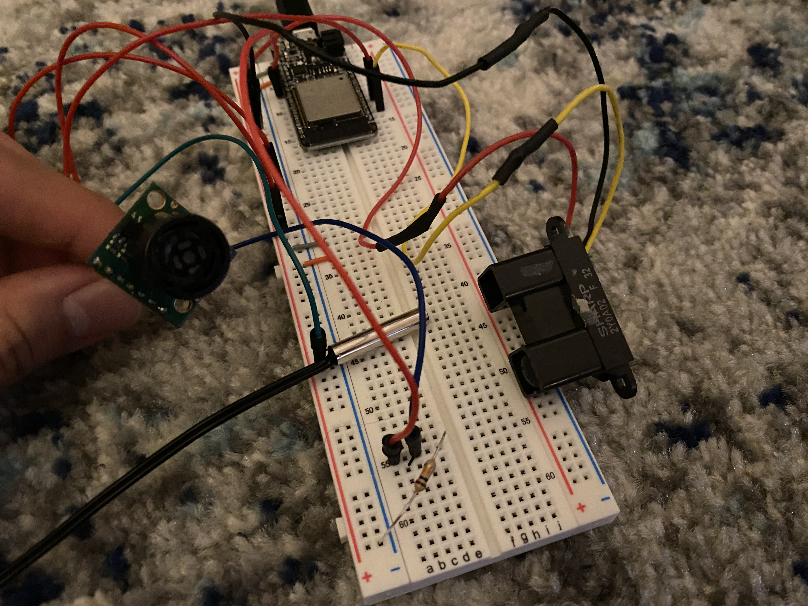
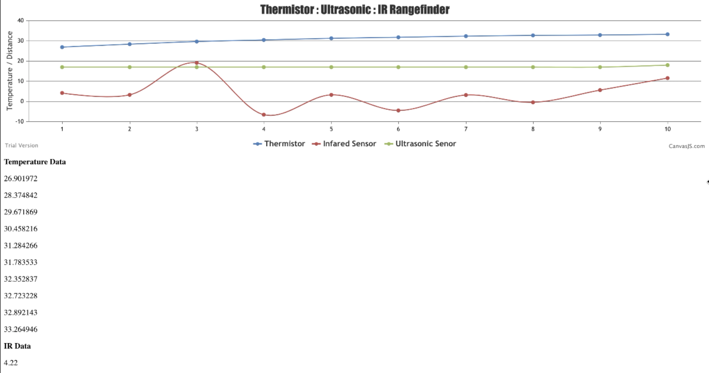
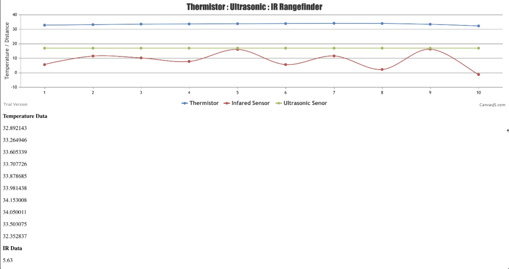

# Tactile Internet
Authors: John Kircer, Alex Prior, Allen Zou

Date: 2020-10-08
-----

## Summary
Using the ESP32 and its built in ADC channels, we are able to read data from three sensors that report temperature and range data using ultrasonic and IR readings. In addition to that, we are able to visualize the data on a chart using CanvasJS in real time.

## Self-Assessment

### Objective Criteria

| Objective Criterion | Rating | Max Value  | 
|---------------------------------------------|:-----------:|:---------:|
| Periodic reporting of ultrasonic range in m | 1 |  1     | 
| Periodic reporting of IR range in m | 1 |  1     | 
| Periodic reporting of temperature in C | 1 |  1     | 
| Results displayed at host as text | 1 |  1     | 
| Results graphed at host continuously based on reporting period | 1 |  1     | 
| Demo delivered at scheduled time and report submitted in team folder with all required components | 1 |  1     | 
| Investigative question response | 1 |  1     | 

### Qualitative Criteria

| Qualitative Criterion | Rating | Max Value  | 
|---------------------------------------------|:-----------:|:---------:|
| Quality of solution | 4 |  5     | 
| Quality of report.md including use of graphics | 3 |  3     | 
| Quality of code reporting | 3 |  3     | 
| Quality of video presentation | 3 |  3     | 

## Solution Design
## ADC:
This quest takes advantage of the ESP32’s ADC pins to read analog readings from external sensors and convert them into voltage readings that can be manipulated into more tangible data such as temperature or range. 

## Sensors:
To separate each sensor, we created individual tasks that would collect data and run simultaneously with one another. 

The first of our sensors is the thermistor which we connected to ADC channel 6 or the GPIO34 pin. Every two seconds, we record the voltage data and determine the variable resistance and use the Simplified Steinhart-Hart equation to get the temperature reading.

The next sensor is the IR range finder which is connected to ADC channel 4 or the GPIO32 pin. Like the thermistor, every two seconds, we get voltage data and using the IR rangefinder datasheet, we take the slope and y-intercept of the distance to voltage graphs to convert voltage into centimeters.

Lastly, the Ultrasonic sensor is connected to ADC channel 5 or GPIO33. It records voltage data from the sensor every second and using the MaxSonar Datasheet, we calculate that the conversion from voltage to range requires a 3.222 mv/cm proportion.

## CanvasJS:
After converting these analog values into understandable units for humans, we visualize the data using CanvasJS. We then use node.js to act as a monitor for the ESP32 and read live data outside of the esp terminal. Once data is coming through, we parse it and populate it into arrays that can be passed into the HTML file. Then, in the HTML file we use jQuery ajax calls to request the data arrays to display on a dynamic line chart.

## Sketches and Photos
Breadboard Setup:

  
CanvasJS charts:
 
 

## Investigative Question
Tabulate and compare the accuracy and speed of the IR and ultrasonic sensors. Which one would you prefer to use to support driving a robotic car?
The ultrasonic sensor was much more accurate than the IR sensor. It was a lot more responsive to changes and was easier to locate where it was even pointing. A look at the Maxbotix website also states that IR is a more budget friendly version of range finding. If we are driving a robotic car, we would want it to be safer and more perceptive to obstacles so we want the ultrasonic sensor/ 

## Supporting Artifacts
- [Link to video demo](https://drive.google.com/file/d/1S0a1OUo86MVyoaFrnBMyIMuOZZMKdgP6/view?usp=sharing
).

## Modules, Tools, Source Used Including Attribution

## References

-----

