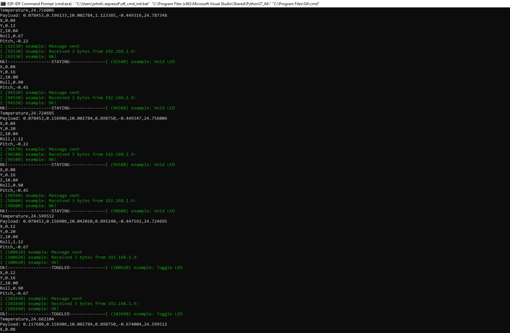

# Hurricane Box with Remote Access
Authors: Allen Zou, Alex Prior, John Kircher

Date: 2020-10-23
-----

## Summary
The goal of this quest was to take thermistor and accelerometer data from the ESP32, send it to a web server created with node.js using UDP sockets, and display this data dynamically on a webpage. The webpage also displays a livestream using the webcam on the Raspberry Pi Zero, and a button for turning an LED on the ESP32’s breadboard on and off. The ESP32 and Raspberry Pi are connected wirelessly, with DDNS and port forwarding being utilized to access the webpage from anywhere in the world. 

## Self-Assessment

### Objective Criteria

| Objective Criterion | Rating | Max Value  | 
|---------------------------------------------|:-----------:|:---------:|
| Measures acceleration, temperature, and battery level | 1 |  1     | 
| Displays real-time data (temperature, vibration, battery level) at remote client via portal using separate IP network. | 1 |  1     | 
| Controls LED on box from remote client via portal.  | 1 |  1     | 
| Sources web cam video into remote client. | 1 |  1     | 
| ESP32 and Rpi are connected wirelessly to (or as) router; ESP32 sensor data are delivered to local node server (on local laptop or Rpi) | 1 |  1     | 
| Demo delivered at scheduled time and report submitted in team folder with all required components | 1 |  1     | 
| Investigative question response | 1 |  1     | 

### Qualitative Criteria

| Qualitative Criterion | Rating | Max Value  | 
|---------------------------------------------|:-----------:|:---------:|
| Quality of solution | 5 |  5     | 
| Quality of report.md including use of graphics | 3 |  3     | 
| Quality of code reporting | 3 |  3     | 
| Quality of video presentation | 3 |  3     | 

## Solution Design
# Thermistor and Accelerometer:
It was quick and easy to set up the accelerometer for this quest. We chose to work off the same codebase from Skill 24, using the i2c_accel.c file provided in the code-examples directory. By doing this, the accelerometer data was already being converted into engineering units and printed to the terminal, providing us with a great launching point.

It was similarly quick and easy to set up the thermistor for this quest. We chose to recycle our Skill 13 code, pasting it into our i2c_accel.c codebase and successfully getting the thermistor data to print to the terminal. Once we had both thermistor and accelerometer data printing to terminal from the same program, we began to focus on sending the data wirelessly to our NodeJS server.

# Sending UDP Messages between ESP and NodeJS server:
We chose to use UDP sockets to send data over the network to our NodeJS server. In order to do this, we needed to connect the ESP32 to the network wirelessly. To do this, we used the code from Skill 22 to connect to our router.

Once it was connected to the network, we established a UDP client on the ESP to package the thermistor and accelerometer data into a single payload that can be sent to a UDP server listening from NodeJS every 0.5 seconds. On the NodeJS server, we configured the UDP server to receive the payload, parse it, and store the thermistor data, X, Y, and Z values, pitch, and roll in unique variables that are used to dynamically update div tags on the front end.

# Button and LED:
To toggle the LED, we used a button on the HTML page. The button is bound to the client side javascript using a document.querySelector and has an event listener that waits for a user click. Once it is clicked, the client side javascript makes a fetch call to a route on the server side to turn on a flag variable. The flag variable will then respond to the ESP with a UDP response of “Ok!”, which causes an event on the ESP C file to toggle the LED. 

# Presenting Data and Video Stream:
To set up the webcam stream, we followed the tutorial on hackster.io (in attributions). It is served on port 8081 and updates at a 10 frames per second. To add it into our webpage, we create an img tag that points port 8081 on the DDNS server. It will update live with the webstream but has delays due to the slow frame rate.

## Sketches and Photos
Breadboard Setup:
 

 
RaspberryPi Setup:
 
 
 
Terminal Output During Testing:
 
 
 
Webpage Layout:
 
 

## Investigative Question
What are steps you can take to make your device and system low power? Please cite sources for you answer.
Research has determined that a bulk of wireless sensor network power consumption comes from trasnmitting data rather than the expected data collection. One way that we can decrease the power consumption is to implement cluster based protocols such as Low Energy Adaptive Clustering Hierarchy Protocol (LEACH) or Virtual Grid based Dynamic Routes Adjustment (VGDRA). By clustering sensor data and sending it from only one node the network and determine the most optimal times to send data and minimize how many times we have to trasmit back and forth. This will allow the system to have steady states where it can "rest" and conserve energy.

Sources for this answer: 
- https://link.springer.com/article/10.1007/s00779-019-01205-4
- https://www.sciencedirect.com/science/article/pii/S131915781730023X

## Supporting Artifacts
- [Link to video demo](https://drive.google.com/file/d/1f9fklLlsxecqIVp7K62db-wnEkJHCFs1/preview).

## Modules, Tools, Source Used Including Attribution
- Whizzer Socket Brief: http://whizzer.bu.edu/briefs/design-patterns/dp-sockets
- Motion webcam: https://www.hackster.io/narender-singh/portable-video-streaming-camera-with-raspberry-pi-zero-w-dc22fd
- Skills 13, 22, 24 code
- ADC Guide from Whizzer: https://docs.espressif.com/projects/esp-idf/en/latest/esp32/api-reference/peripherals/adc.html
- ADC example code: https://github.com/espressif/esp-idf/tree/39f090a4f1dee4e325f8109d880bf3627034d839/examples/peripherals/adc
- Wifi Station Sample Code: https://github.com/espressif/esp-idf/tree/master/examples/wifi/getting_started/station
- Tilt_Sensing: https://wiki.dfrobot.com/How_to_Use_a_Three-Axis_Accelerometer_for_Tilt_Sensing
- ADXL343 Sample Code: https://github.com/BU-EC444/code-examples/tree/master/i2c-accel
- ADXL343 Datasheet: https://cdn-learn.adafruit.com/assets/assets/000/070/556/original/adxl343.pdf?1549287964

## References

-----

