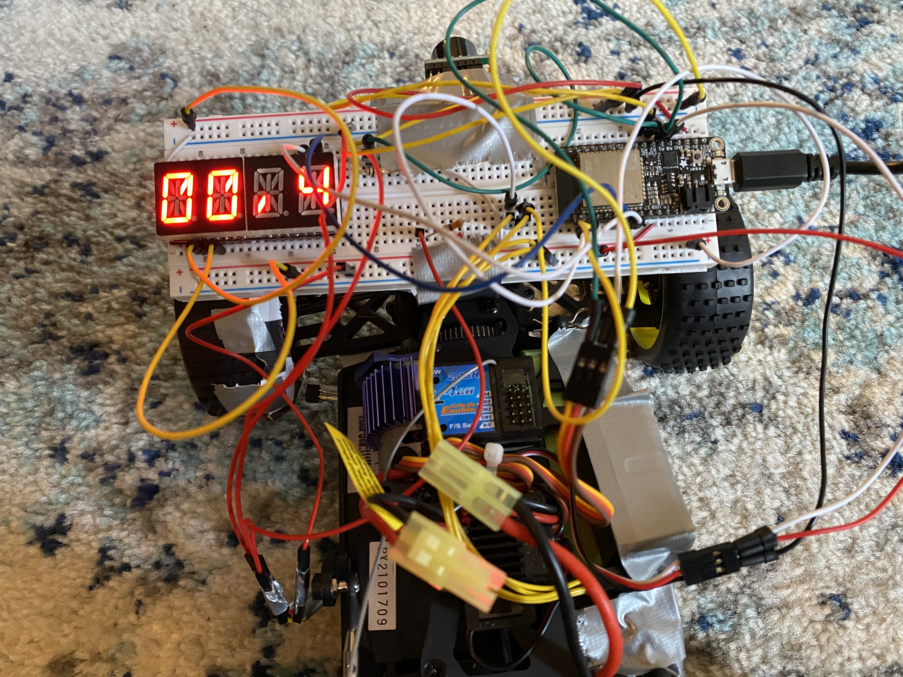

# Cruise Control
Authors: Allen Zou, Alex Prior, John Kircher

Date: 2020-11-30
-----

## Summary
For this quest, we were tasked with creating a cruise control and collision avoidance system for an RC car. We achieve this using an ultrasonic sensor, a LIDAR sensor, an optical encoder, and PID control. Using these tools, we are able to stay within +/- 25cm of a centerline, detect hazards in front of the car to stop collisions, and maintain a fixed speed. Finally, we implemented UDP socket communication allowing us to instantaneously start and stop the car from a server. 

## Self-Assessment

### Objective Criteria

| Objective Criterion | Rating | Max Value  | 
|---------------------------------------------|:-----------:|:---------:|
| Controls steering to maintain center of course +/- 25cm for entire length | 1 |  1     | 
| Uses PID for speed control holding a fixed speed setpoint after startup and before slowdown [0.1-0.4 m/s] | 1 |  1     | 
| Stops within 20 cm of end without collision | 1 |  1     | 
| Start and stop instructions issued wirelessly from phone, laptop or ESP) | 1 |  1     | 
| Measures wheel speed or distance | 1 |  1     | 
| Uses alpha display to show current distance or speed | 1 |  1     | 
| Successfully traverses A-B in one go, no hits or nudges | 1 |  1     | 

### Qualitative Criteria

| Qualitative Criterion | Rating | Max Value  | 
|---------------------------------------------|:-----------:|:---------:|
| Quality of solution | 5 |  5     | 
| Quality of report.md including use of graphics | 3 |  3     | 
| Quality of code reporting | 3 |  3     | 
| Quality of video presentation | 3 |  3     | 

## Solution Design

### PID Speed Control and Ultrasonic Sensing
For our speed control algorithm we used PID. While maintaining the error, setpoint, and range variables, we are able to determine the output/speed to be sent to the drive servo. We executed the following instruction to determine the output to be sent to the wheel servo:

  - error = setpoint - range
  
We calculate error here as the current distance from the object in front of the crawler and a setpoint of 100cm. Determining if the crawler is reading less than 25cm or greater than 25cm we slowly decrease the wheel speed and come to a stop or we continue driving straight.
            
An ultrasonic sensor which is mounted at the front of our car is constantly checking how close we are to the nearest object and continues to output a range. The ultrasonic sensor and our range value is used hand in hand with PID; specifically, we set our error in PID to be setpoint - range. Looking in with a wider scope, our crawler is able to come to a complete stop and avoid collisions within 20cm of the closest object. 

### LIDAR and Steering Control
We decided to use the microLIDAR sensor to control steering for our crawler. We ultimately opted to use LIDAR for steering since the sensor is more accurate than the ultrasonic sensor and we care about staying on a course of +-25cm. A huge challenge was turning the 8-byte hex values from the microLidar into readable values that we can turn into a distance from the wall in centimeters. Since we only care about the 3rd and 4th bytes which correspond to distance, when we read them from the hexdump we put them into a single 16 bit value that we can read as distance in centimeters. 

In our testing case, we use one LIDAR sensor on the right side of the crawler. As we continuously read the LIDAR value, we check to see if we are getting close to a wall. Using conditionals, we check the crawler's distance from the wall and turn the wheels right or left to keep the car on our center line. 

### Wheel Speed Detection Using Optical Encoder
For accurate speed control we used an optical encoder/pulse counter. To implement this we attached our back right wheel with a donut-shaped piece of paper with alternating white and black sections, (3 of each). Since the pulse counter increases voltage at lower brightnesses there will be a sharp increase at each black section. After sampling the number of wheel rotations over a certain interval, we were able to determine wheel speed using the wheel's circumference. Futhermore this wheel speed is dynamically displayed on the alphanumeric display mounted on the top of our crawler. 

### Alphanumeric Display
The alphanumeric display was used to dynamically display the crawler's speed. To do this we had to use another I2C bus since the first one was being used for the ultrasonic sensor. For the second bus we chose two new GPIO pins (27 and 33). To accurately display the correct speed we define an alphaFontTable array containing integers 0-9. We loop through each digit in the table until we find the digits that correspond to our wheelSpeed. Once found, the display is updated with the correct speed that we are reading. 

### UDP Communication
To turn the crawler on/off wirelessly, we connected a node.js server to the ESP through UDP socket connections using a home router. From the server we have a button that sends a toggle message which is received from the udp_client_task inside the c program. This message toggles a boolean variable 'startCrawler' which starts as false. Since we only want to stop the car from driving we insert a loop into the PID task that is enabled by this variable. So when the boolean is true, the car continues to drive, and when it is false, it stops. 

## Investigative Question
We think the best way to implement adaptive cruise control would be to add another sensor. In this case, we would most likely add another microLidar sensor as it is the most accurate. We would place this sensor on the back of the crawler forcing it to maintain a distance between the car in front of it and the car behind it. This way it would maintain an even more constant speed and be even more accurate. 

## Sketches and Photos

### Track Bird's Eye View 1:

### Track Bird's Eye View 2:

### Track Perspective:

### Crawler Side View:

### Optical Encoder and Back Wheel:

### Ultrasonic Sensor:

### Alphanumeric Display:

## Supporting Artifacts
- [Link to video demo](https://drive.google.com/file/d/1LhutXZ3WRjyGVatawDwrV4Y6XbVXtaqL/view?usp=sharing)

## Modules, Tools, Source Used Including Attribution
- GPIO
- ADC
- I2C
- UDP
- Ultrasonic Sensor
- Garmin v4 LIDAR Sensor
- Garmin v4 LIDAR Documentation: http://static.garmin.com/pumac/LIDAR-Lite%20LED%20v4%20Instructions_EN-US.pdf

## References

-----

